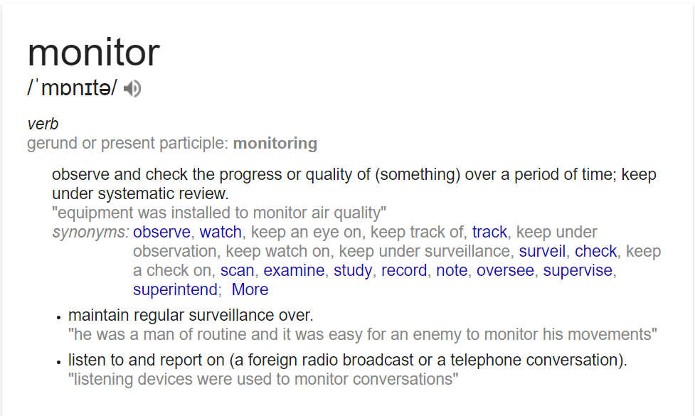
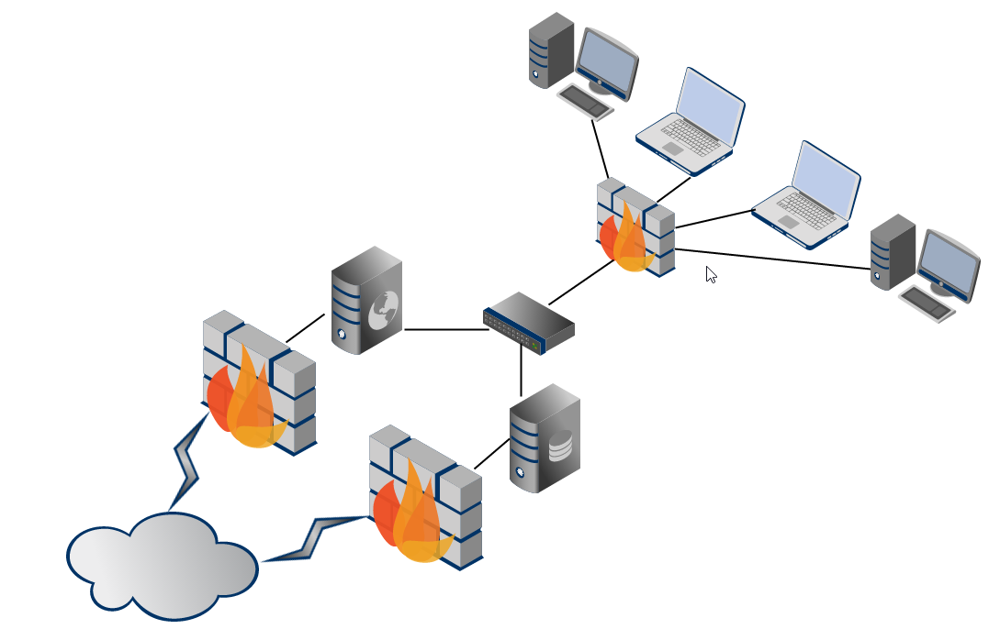
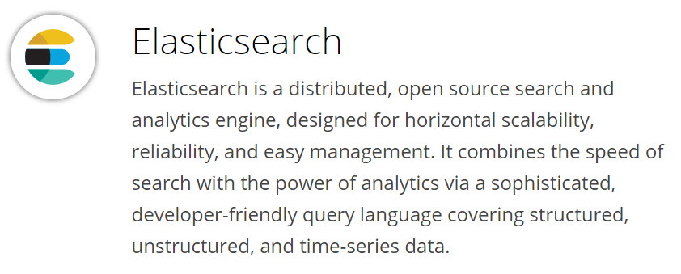
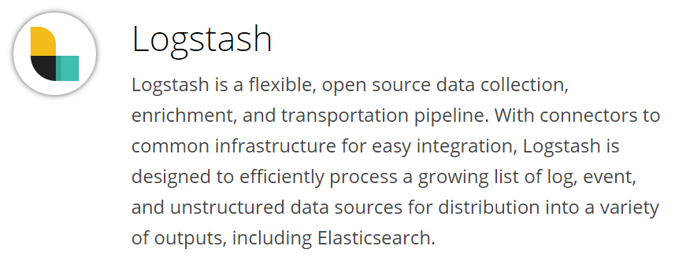
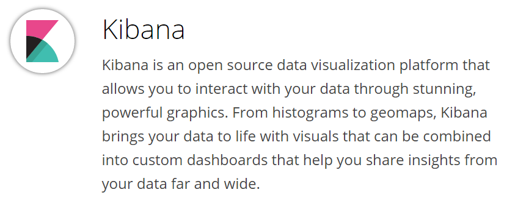
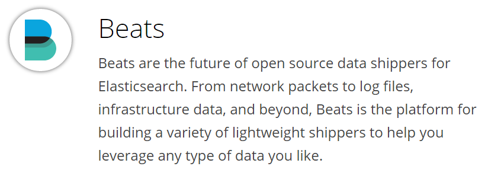
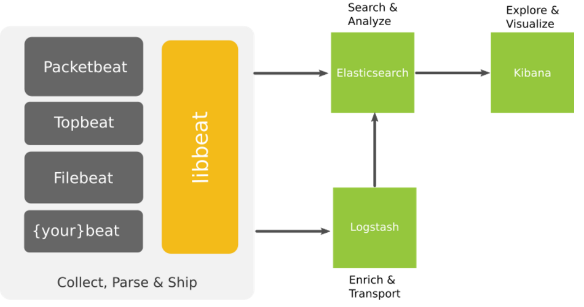

# Ninja level Infrastructure Monitoring
#### Defensive approach to Security Monitoring & Automation
Defcon24 - Las Vegas 

---

## Hello everyone :)
#### Welcome to our awesome workshop!

---

## SCHEDULE

Saturday, 6th August 2016 
10:00 - 14:00
 

There will be a 15 minute break at 11:45 AM

---

Basic overview: 30 min 
Setting up the ELK stack (hands on): 75 min 
Backing up elasticsearch using curator (hands on): 15 min 
Alerting & Advanced dashboards (hands on): 30 min 
A note on best practices: 10 min 
Penetration testing findings: 10 min 
Ansible Playbook for the entire setup: 10 min 
Exercise (hands on): 30 min 
Q & A

---

### Pre-requisites

- This workshop is intended for beginner to mid-level, we are expecting that participants are comfortable with basic Linux CLI usage
- Laptop with administrative privileges (to install VirtualBox)
- VirtualBox
- 20GB hard disk space for virtual machines
- Minimum 4 GB RAM
- Enthusiasm to learn cool stuff :)

---

## Instructions
1. Please follow the commands and the overall flow as given in the slides
2. Please direct all questions/queries to me and Madhu

---

## What will you learn today?
- Infrastructure monitoring by aggregating and analysing logs
- Centralised logging using the ELK stack
- Creating attack pattern dashboards for monitoring
- Exporting and Importing dashboards for reporting and reuse
- Advanced configurations of the ELK stack

---

## (Bonus)
Best practices and Security Tips

---

## What we are not covering
- Performance tuning and optimisation for clusters
- Multi cluster configurations
- Custom plugins and scripts for Logstash

Note: Time constraint + Internet access + Resource constraints

---

## So what is Ninja Level Infrastructure Monitoring?

----

### What is monitoring?

Note: observe an event and check the progress over a period of time.

----

### What is this 'infrastructure' we keep talking about?
>

Note: All your assets in an enterprisey environment. The routers, firewalls, web app servers, linux boxes, ldap servers, database servers etc.

----

### What is 'Ninja level'?
>Errrrr.. This was simply added to make this workshop title cooler :)

---

## About us

----

### Madhu Akula

- Automation Ninja @Appsecco
- Security & DevOps lover
- Trainer & Speaker
- Acknowledged by more than 200 giant companies like Google, Microsoft, Yahoo, Adobe, etc for finding security vulnerabilities
- Open source contributor
- Never ending learner!
- Twitter: @madhuakula

----

### Riyaz Walikar

- Chief Offensive Security Officer @Appsecco
- Over 9 years of industry experience in breaking infrastructure security and web applications
- Security evangelist, leader for null Bangalore and OWASP chapters
- Trainer/Speaker : BlackHat Asia, BlackHat USA, nullcon Goa, nullcon Delhi, c0c0n, OWASP AppSec USA
- Twitter : @riyazwalikar and @wincmdfu

Note: As COSO, it is interesting/important to analyze logs for attack patterns, look at real world exploits coming in and map them to give better recommendations to clients  One of the most underrated vulnerabilities out there is OWASP A5 (Security Misconfiguration) -> Sanity Check and logs can help detect.

----

### About Appsecco
Enable companies to design, specify, develop and purchase software that is secure

Work with companies to test existing software they have for security issues and give them the information they need to fix any problems we find

Ensure that companies can recover from security incidents they suffer and work with them to stop them from reoccurring

---

### Quick look at the basics of "centralised" logging

----

## What are logs?

- A log (file) is a collection of records or events
- Logs used to be a (often indecipherable) line of text intended for offline human analysis of what went wrong
- Logs are a critical part of any system giving you an insight into the working of a system

----

## Why is it boring to work with logs?
- Can be pretty large
- Correlation can be painful
- Others?

----

## What is centralised logging?

- Managing logs and accessing them can get complicated with multiple hosts
- Searching for a particular error across hundreds of log files on hundreds of servers is difficult without good tools
- A common approach to this problem is to setup a centralised logging solution so that multiple logs can be aggregated in a central location

----

### How is it different from traditional logging?
- Logs are collected at a central server
- Parsing becomes simpler since data is accessible at a single location
- A common issue across multiple hosts/services can be identified by correlating specific time frames

----

### What are the problems of traditional logging?

----

#### No Consistency 
(it’s difficult to be jack-of-all trades)

- Difficulty in logging for each application, system, device
- Interpreting various type of logs
- Variation in format makes it challenging to search
- Many types of time formats

----

#### No Centralisation 
(simply put, log data is everywhere)

- Logs in many locations on various servers
- SSH + GREP don’t scale

----

#### Accessibility of Log Data 
(much of the data is difficult to locate and manage)

- Access is often difficult
- High expertise to mine data
- Logs can be difficult to find
- Immense size of Log Data

---

## The ELK stack

----

### Elasticsearch, Logstash and Kibana
Different open source modules working together

----

- Helps users/admins to collect, analyse and visualise data in (near) real-time
- Each module fits based on your use case and environment

----

### Components of the stack

- Elasticsearch
- Logstash
- Kibana
- (Beats)

---

##
<small>Ref: https://www.elastic.co/products</small>

----

## Elasticsearch
- Distributed and Highly available search engine, written in Java and uses Groovy
- Built on top of Lucene
- Multi Tenant with Multi types and a set of APIs
- Document Oriented providing (near) real time search

---

## 
<small>Ref: https://www.elastic.co/products</small>

----

## Logstash
- Tool for managing events and logs written in Ruby
- Centralised data processing of all types of logs
- Consists of 3 main components
    + Input : Passing logs to process them into machine understandable format
    + Filter : Set of conditions to perform specific action on a event
    + Output : Decision maker for processed events/logs

---

## 
<small>Ref: https://www.elastic.co/products</small>

----

### Kibana
- Powerful front-end dashboard written in JavaScript
- Browser based analytics and search dashboard for Elasticsearch
- Flexible analytics & visualisation platform
- Provides data in the form of charts, graphs, counts, maps, etc. in real-time

---

## 
<small>Ref: https://www.elastic.co/products</small>

----

### Beats
- Lightweight shippers for Elasticsearch & Logstash
- Capture all sorts of operational data like logs or network packet data
- It can send logs to either elasticsearch, logstash

----

- Different kind of beats
    + Libbeat : The Go framework for creating new Beats
    + Packetbeat : Tap into your wire data
    + Filebeat : Lightweight log forwarder to Logstash & Elasticsearch
    + Winlogbeat : Sends windows event logs

----

#### Filebeat
- Lightweight Shipper for Log Data
- Filebeat is an opensource file harvester
- Used to fetch logs files and feed them into logstash
- It has replaced logstash-forwarder

---

## ELK overview
>
<small>Ref: https://www.elastic.co/products</small>

---

## A quick history lesson

----

### About Elastic

- `Shay Banon` created Compass in 2004, third version of Compass is the first version of Elasticsearch, released in Feb 2010
- Elasticsearch was founded in 2012, Rashid (Kibana) joined Jan 2013 and Jordan (Logstash) joined in Aug 2013. (elastic.co)
- Combined stack is now called `Elastic Stack` and `X-Pack`

---

## Terms we should be aware of in context to ELK

----

### Node

> A node is a running instance of elasticsearch which belongs to a cluster.

----

### Cluster

> Cluster is a collection of one or more nodes that together holds your entire data and provides indexing and search capabilities across all nodes. 

 
> Nodes must have the same cluster.name to belong to the same cluster.

----

### Document

> A document is a basic unit of information that can be stored and searched. 
 
 

>It refers to the top-level, or root object that is serialised into JSON and stored in Elasticsearch under a unique ID.

----

### Index

> An index is a collection of documents that have somewhat similar characteristics. It has mappings which define multiple types.

----

### Type

> Within an index, you can define one or more types. A type is a logical category/partition of your index whose semantics are completely up to you.

----

### Shard

> Elasticsearch provides the ability to subdivide an index into multiple pieces called shards since an index can store a large amount of data that can exceed the hardware limits of a single node. 

 
> Each shard is in itself a fully-functional and independent "index" that can be hosted on any node in the cluster.

Note: For eg, a single index of a billion docs taking up 1TB of disk space may not fit on the disk of a single node or may be too slow to serve search requests from a single node alone.

When you create an index, you can simply define the number of shards that you want.

----

### Replica

>Elasticsearch allows you to make one or more copies of your index’s shards into what are called replica shards, or replicas for short.

Note: For this reason, it is important to note that a replica shard is never allocated on the same node as the original/primary shard that it was copied from
It provides high availability in case a shard/node fails. Also to scale out your search volume/throughput since searches can be executed on all replicas in parallel

--- 

### Snapshot and Restore

> A copy of the current state and data in a cluster that is saved to a shared repository.

> Elasticsearch provides a snapshot API to achieve this.

----

### Routing

> A mechanism in Elasticsearch that identifies which shard a particular document resides in.

----

### Near real time

> Elasticsearch is a near real time search platform. 

 

> What this means is there is a slight latency (normally one second) from the time you index a document until the time it becomes searchable.

---

### [Setting up the ELK Stack](02-setup.md)