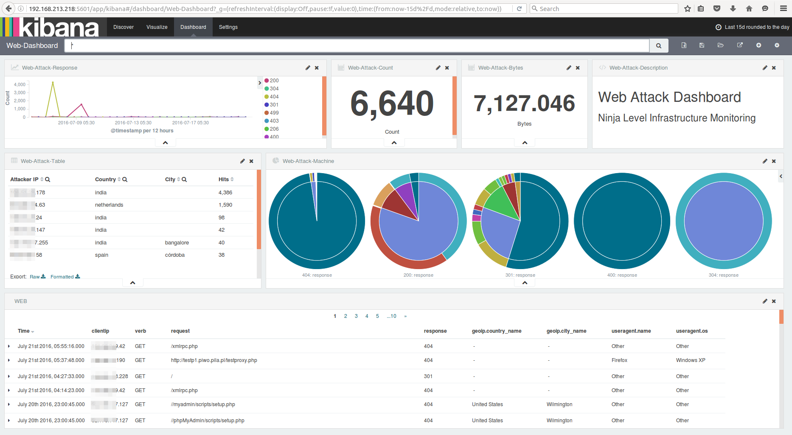
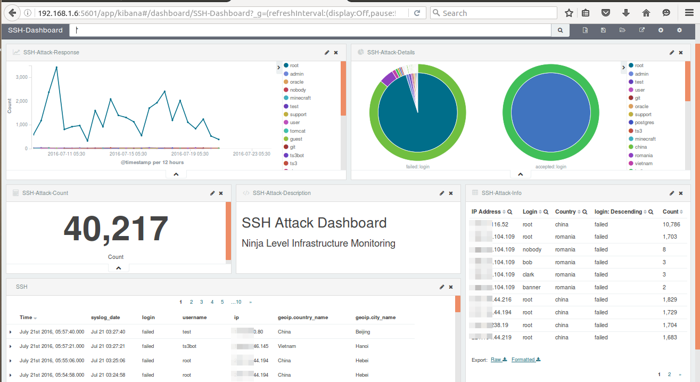
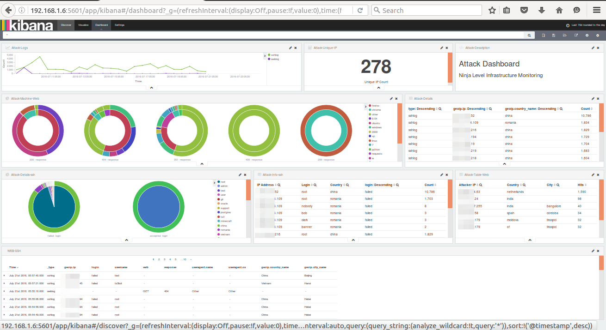

# Alerting & Attack patterns dashboard
<small>[30 minutes]</small>

---

## Alerting

----

### What is alerting for ELK stack?

> We can set up a notification system to let users/admins know that a pattern match has occurred.

----

### How is this achieved?

- Logstash output plugin alerting via (Email, Pager duty, JIRA, etc.)
- Elasticsearch commercial product - Watcher
- An open source alerting for elasticsearch by Yelp called `elastalert`
- Custom scripts

----

### Creating an alert for DDoS attack on SSH Logs
(hands on)

----

<div align="left">Create a new log configuration using</div>

```
sudo vi /etc/logstash/conf.d/ddos.conf
```

----

```
input {
    file {
        path => '/home/ninja/log-samples/ddos.log'
        start_position => "beginning"
        ignore_older => 0
    }
}

filter {


grok {
    add_tag => [ "valid" ]

    match => [
      "message", "%{SYSLOGTIMESTAMP:syslog_date} %{SYSLOGHOST:syslog_host} %{DATA:syslog_program}(?:\[%{POSINT}\])?: %{WORD:login} password for %{USERNAME:username} from %{IP:ip} %{GREEDYDATA}",
      "message", "%{SYSLOGTIMESTAMP:syslog_date} %{SYSLOGHOST:syslog_host} %{DATA:syslog_program}(?:\[%{POSINT}\])?: message repeated 2 times: \[ %{WORD:login} password for %{USERNAME:username} from %{IP:ip} %{GREEDYDATA}",
      "message", "%{SYSLOGTIMESTAMP:syslog_date} %{SYSLOGHOST:syslog_host} %{DATA:syslog_program}(?:\[%{POSINT}\])?: %{WORD:login} password for invalid user %{USERNAME:username} from %{IP:ip} %{GREEDYDATA}",
      "message", "%{SYSLOGTIMESTAMP:syslog_date} %{SYSLOGHOST:syslog_host} %{DATA:syslog_program}(?:\[%{POSINT}\])?: %{WORD:login} %{WORD:auth_method} for %{USERNAME:username} from %{IP:ip} %{GREEDYDATA}"
    ]
  }


  mutate {
    remove_tag => [ "valid" ]
    lowercase => [ "login" ]
  }
  

  date {
    match => [ "syslog_date", "MMM  d HH:mm:ss", "MMM dd HH:mm:ss", "ISO8601" ]
    timezone => "Europe/Helsinki"
  }

  geoip {
    source => "ip"
  }

  throttle {
    before_count => 0
    after_count => 5
    period => 5
    key => "%{ip}"
    add_tag => "throttled"
  }
}

output {
  if "throttled" in [tags] {
    email {
        subject => "DDoS attack on %{host}"
        to => "root"
        via => "sendmail"
        body => "Alert on %{host} from %{ip} :\n\n%{message}"
        #options => { "location" => "/usr/sbin/sendmail" }

    }
  }
    elasticsearch { 
    hosts => ["localhost:9200"]
    index => "DDoS"
} 
}
```

----

<div align="left">Load the DDoS config file</div>

```
sudo /opt/logstash/bin/logstash -f /etc/logstash/conf.d/ddos.conf
```

----

- Check the mailbox of `root` user 

```
sudo -i

mail
```

----

### Other options
Elastalert (https://elastalert.readthedocs.io/en/latest/)
<br />
<br />
`Watcher` is another commercial product for alerting on top of Elasticsearch

---

## Dashboards for Attack Patterns
(hands on)

Note: We have already imported logs to Elasticsearch using curator. <br />
Now create some advanced dashboards for attack patterns using Kibana

----

### Web Attack Dashboard



----

### SSH Attack Dashboard



----

### Combined Attack Dashboard



---

### Pre-created dashboards

----

#### Import the JSON which is already existing in your folder

1. Go to the kibana settings
2. Select import 
3. Select the JSON file `/dashboards/all-kibana.json`

---

### [Ansible Playbook](05-ansible-playbook.md)


