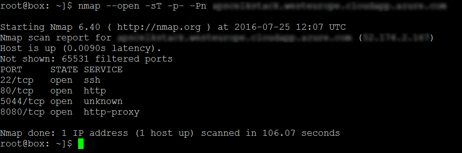
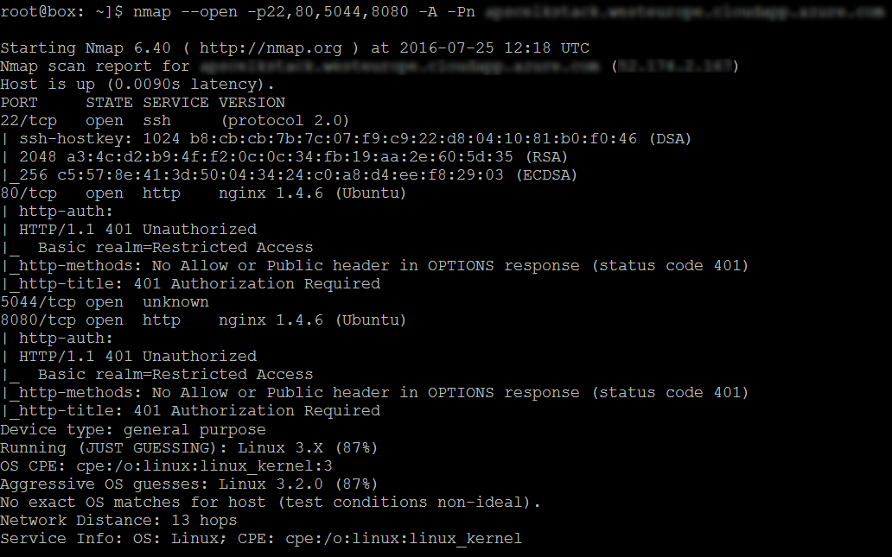
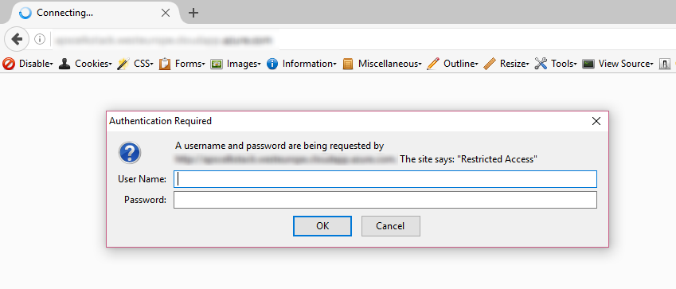
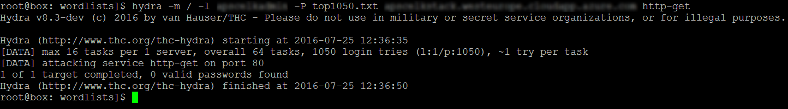
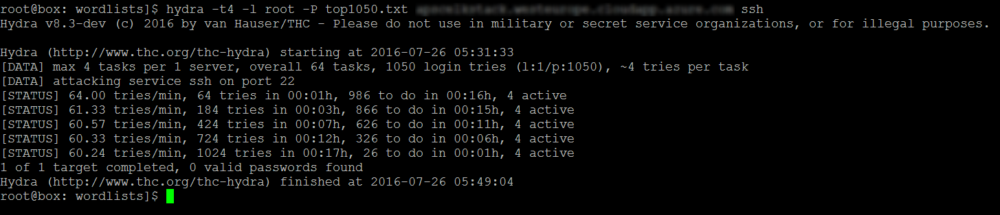
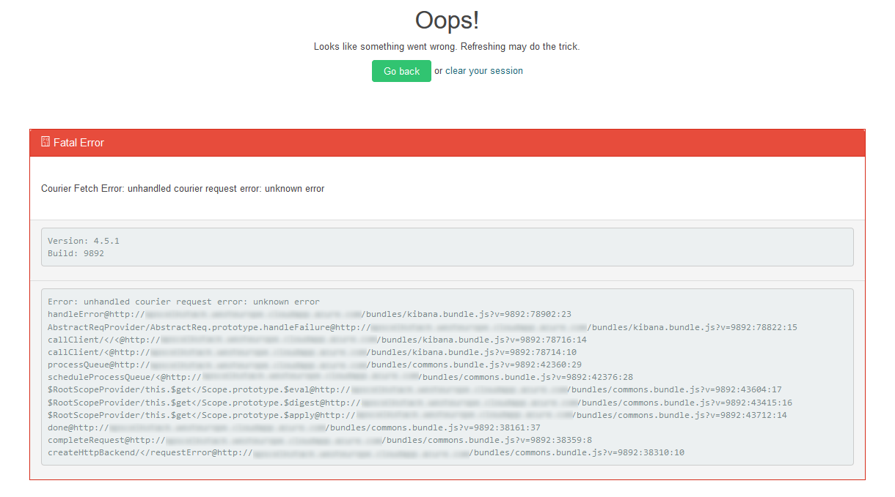
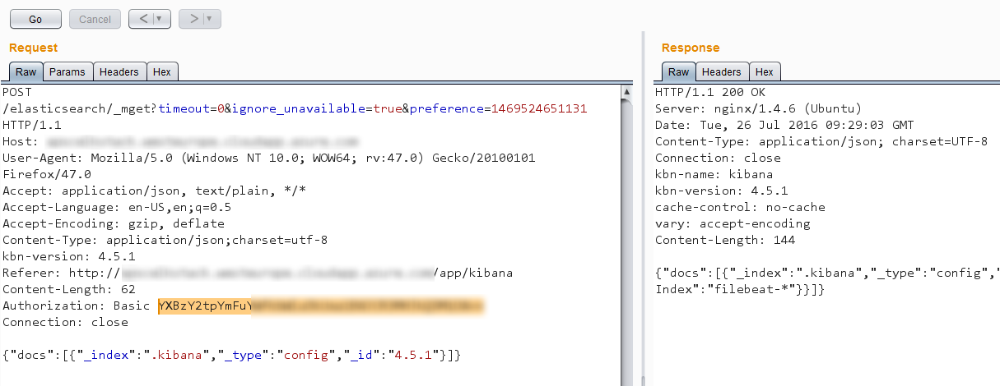
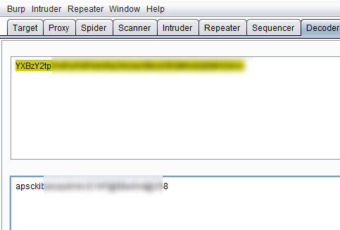

# Pentesting the infrastructure
(what does an attacker see?)

<small>[10 minutes]</small>

---

## The Why?
A penetration testing exercise was undertaken to check if there was a possibility of gaining unauthorized access to the setup

---

## Black Box Penetration Testing

----

### Port scanning

----

### Service enumeration

----

### HTTP basic Auth on ports 80 and 8080

----

### Attempted brute force
Multiple dictionaries were tried against the HTTP Basic Auth

----

### Attempted brute force
Multiple dictionaries were tried against SSH as well

---

## Grey Box Penetration Testing
App credentials were provided

----

### Verbose Errors

----

### Credential Leakage through MiTM

----

----

Drop us a note if you want the complete pentest report   
riyaz@appsecco.com

---

### [Exercises](08-exercise.md)