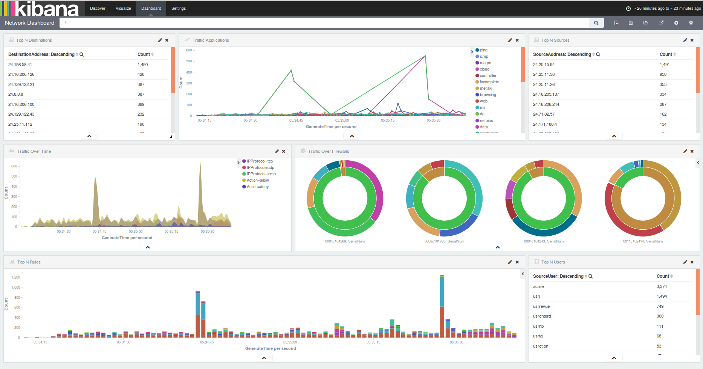

# ELK - Exercise with network logs
<small>[30 minutes]</small>

---

## Stack Flow

#### CSV firewall log(network.log) -> logstash(network.conf) -> elasticsearch -> kibana(kibana-network.json)

----

- `network.log` file is at `/home/ninja/log-samples/network.log`
- `network.conf` file is at `/home/ninja/exercise/network.conf` for logstash configuration
- Build your own dashboard using the log data
- We created one. If you want to use, import the `/dashboards/kibana-network.json`
- Happy ELK!

---

---

Note: ELK can also be used to do other amazing things like correlate password dumps for example and give a visual statistical model of the data contained in the dump.
 
There is a list of user names and passwords at `/home/ninja/log-samples/pwd-dump.txt`. As and additional exercise, create a dashboard using this file and build statistical dashboard.

---

### [Q & A](09-q-and-a-end.md)